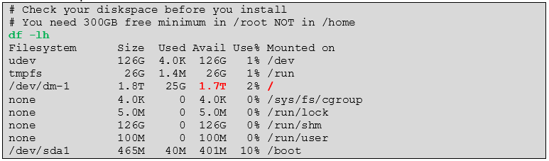

# Lab documentation essentials including Word to HTML conversion

## Note: Some of the original information is missing here on purpose to keep this README.md crisp! Please use the supplied File Lab-doc-essentials.docx for more detailed information.

# 1	WHY this Framework?
We have developed this Framework inside Juniper to document internal Labs and deployed IT-Infrastructure so **that others can EASILY re-use it** to get to the same or similar results.

**The focus is to be able to produce a documentation that is intended for someone who have never seen the lab before to run it and to build own labs themselves.**

Labs and IT-Infrastructure in general change all the time and it is hard to follow them without **having examples** (especially when they are tested). If you already produced examples, then it would be good if you are able to help others in a way that:
- Allow People to cut and paste the example of your code/CLI to directly use it. This will save their precious time by typing in stuff and limits errors.
- Tell People what is important to check when they execute one off your examples. You are the Expert when you create the Lab so you must tell others where to look at. Limit the Time others need to review your documentation. As example when you document a something from a Logfile output with like 30 lines of output and only one or few lines are relevant then highlight those important lines and don’t have people trying to find out what is important.
- Tell People upfront if there are any changes that will need to be adopted when they repeat your example. Do not assume someone knows about potential changes one has to do to adapt something for his lab. For example, if there are just a few changes of a Router Configuration to get if operational in a different location with other IP-Addresses or Interface-Names then tell others about it when you create the lab documentation.

These have been the goals in mind when we created this.
- Make is easy for others to work with your Documents.
- Tell important things in a way that they are obvious and easy to spot.
- Try to limit the Time others must spend on this.
- Tell it in a way that it causes lesser Questions from the audience to you because then People will contact you for help and that doesn’t scale.

<span style="color:blue">Treat yourself as a Movie-Director. You must tell the Story in a way that you don’t lose your audience. So, create a nice documentation that you would like to see from somebody else helping you.</span>

To archive our Mantras, we’ve come up with a Color coding schema that we use for program code, Router configuration and all kinds of CLI-isch things we need to Document. We use a manual Syntax highlighting because the Editor of a Lab documentation usually knows what the important points are the audience needs to know about. We use the following four Text-colors:


With the following example you can easily see how power-full this is and what a great help it is to get this is to get things going and accelerate. You don’t need to be an Expert in Unix but is very easy to see that when you key in the shell-command "df -lh" (green) you will get a resulting output of various things reported (black). As you have marked the important to look at items of your output everyone can simply spot now that the important piece to look after is the mount-point "/" which has 1.7Terabyte capacity avail in our example.



If there would be something in Purple color marked, then your audience would instantly know there is a potential change the have to adapt (especially when they attempt to cut&paste CLI or config-snippets). Like in the example below where you have a complicated CLI-command but in other Labs there may be a different password to be used so you have to exactly mark that piece so that others can easily spot is and modify for own labs like below when they try to reuse your example:


**<span style="color:red">Being able to define and pass over these divine color-markings into the final documentation is a key aspect of this Framework</span>**<span style="color:red"> and it also speeds up the creation of the documentation to need to explain less on how to use the Lab and what expected the results are.</span>

## Sorry but some Chapters are missing here on purpose to keep this README.md crisp

Our goal is to have something that looks in Word like this (with Navigation Pane activated)


To be converted into HTML and then have a very similar (or even better) look and feel like the example below


# 3	Word-Document conversion to HTML with readthedocs theme
Our Lab Framework consists of two important Pieces:
1.	A Word-Template and Styles for the Editor of the Lab documentation. This enables you to create the Documents and use the suggested Color-Schema easily that makes it so easy to follow the instructions.
2.	A Converter that transforms the Word-Doc from the Editor in nice looking static HTML Pages that can be reviewed offline/online via an ordinary (Java-Script enabled) Web-Browser. The Color-Schema is preserved for the original Word. Simple Copy&Paste form HTML is guaranteed to work without losing indents vs. a PDF.

Both approaches and how to use them is explained in the following Chapters.

## 3.1	How to import the Styles of this Document into your existing Doc
The styles (they are reduced to the bare minimum of what you see here) of this document act as template for the conversion. It is important to keep the name of the style the same in the document you want to convert but you can change the look and feel in your own word documents if you like.

You have two methods of getting your own, existing documents updated.

1.	If they are small documents, then it is best to use the Empty-Word-Template.docx File and use that as your own Word-Doc. Then you just use copy and paste from your existing document to the template and make sure it’s getting the right styles applied.

2.	On large existing documents it may pay-off to import the styles for this document and then make sure they are used as appropriate.

<span style="color:red">This second method has the potential back draw that maybe you use a style that’s not known in the first process where we use python-mammoth but check the output of this process and maybe adapt the style-mapping if you run into issues.</span>

The second is a suggestion I found originally here: https://www.extendoffice.com/documents/word/1004-word-import-styles.html.


In my case also the Style-Sheet Quick access Pane automatically added the new Styles so I only need to delete the existing ones that are no longer needed/used which is a right-click on each and then "Remove from Style Gallery".


## 3.2	Using a Docker Container for conversion
This work is based on the suggestion of my colleague Marcel Wiget to use a Container instead of a VM or native Linux-Shell as the original approach was. It’s easier to use and we have tested this with Windows 10, MacOS and Ubuntu-Linux. We’ve passed Word-Docs with more than a 1.000 Pages successfully though this.

<span style="color:red">If your Docker-Platform is Windows 10 then make sure it’s been set to use Linux-Containers and not Windows Containers.</span>

### 3.2.1	Creating the translation Container
Do a "git clone" of the repository or download it as a ZIP-Archive and unpack it. Once this is done go into the sub-directory where the content is. It should be similar to the below:
```
c:\tmp\doc2html>dir

04/15/2020  12:36 PM    <DIR>          .
04/15/2020  12:36 PM    <DIR>          ..
04/08/2020  03:38 PM                82 .gitignore
04/15/2020  10:08 AM            13,230 convert.sh
04/09/2020  09:26 AM               720 COPYRIGHT
04/01/2020  02:59 PM               804 Dockerfile
04/01/2020  10:55 PM            77,567 Empty-Word-Template.docx
04/15/2020  12:24 PM         2,056,312 Lab-doc-essentials.docx
04/08/2020  07:59 PM            18,097 LICENSE
04/15/2020  12:36 PM    <DIR>          newproject
04/15/2020  12:33 PM            19,505 README.md
04/15/2020  12:36 PM    <DIR>          readmemdpictures
```

<span style="color:blue">Make sure you have no other big files in this directory as "Docker build" doesn’t like this.</span>

Then we build the Container locally as shown. The build runs about 10-15 Minutes depending on your Internet connection. When we build the Container, we try to always use the latest version of the Third-Party Software we use but it may happen that we have not tested this combination. In this case you might want to nail a certain version causing you an issue in the Dockerfile. The information which versions we have used is below in the logfile.
```
docker build -t juniper/doc2html .
```

### 3.2.2	Converting a Document from Word to HTML
When you run the document translation via "docker run" you have three argument options to use to instruct the converter:
- You use the **argument "new"**: This will delete, if they exist, the subdirectories "source" and "build" so be warned. Then it calls Sphinx to **generate a new Project** with some minor input you have to give. This will create the local Makefile for Sphinx and generate all necessary Files needed in the Project. We will modify these files as need for the converter to add some modules and so on. When all this is done it seeks for the latest Word-Doc in your directory and attempts to translate it.
- You use **no additional argument**: This assumes that there is an existing Project with sub-directories "source" and "build" and Sphinx-Makefile from a previous run with the "new"-Argument set. So, we will use the existing Project data and attempt to translate the latest Word-Doc in that directory into HTML. Simply use this approach on any changes you did to get a new conversion done.
- You use the **argument "old"**: This is similar like having used no additional argument so, you need an existing Project. This also suppresses the Dynamic Tag generation in the beginning using the previous values. This is useful to speed up the translation on large Documents (>300 Pages) but can cause a collision of one of the 16 Tags we use with the Text inside the Document. So, you have been warned! **This option may have unwanted side-effects!**


The below is an example using the Windows 10 native Shell. On all other Platforms with a more Unix like Shell use instead:
```
docker run -ti --rm -v ${PWD}:/u juniper/doc2html new
```

Here we run the Container for the first time after it’s built so we must add the "new" command for the first translation to build a new Project.
```
c:\tmp\doc2html>docker run -ti --rm -v %cd%:/u juniper/doc2html new
Your container args are: new

Please answer the first question about "Separate source and build directories" with YES
Welcome to the Sphinx 2.4.4 quickstart utility.

Please enter values for the following settings (just press Enter to
accept a default value, if one is given in brackets).

Selected root path: .

You have two options for placing the build directory for Sphinx output.
Either, you use a directory "_build" within the root path, or you separate
"source" and "build" directories within the root path.
> Separate source and build directories (y/n) [n]: y

The project name will occur in several places in the built documentation.
> Project name: myProject
> Author name(s): HS
> Project release []: 1.0

If the documents are to be written in a language other than English,
you can select a language here by its language code. Sphinx will then
translate text that it generates into that language.

For a list of supported codes, see
https://www.sphinx-doc.org/en/master/usage/configuration.html#confval-language.
> Project language [en]:

Creating file ./source/conf.py.
Creating file ./source/index.rst.
Creating file ./Makefile.
Creating file ./make.bat.

Finished: An initial directory structure has been created.

You should now populate your master file ./source/index.rst and create other documentation
source files. Use the Makefile to build the docs, like so:
   make builder
where "builder" is one of the supported builders, e.g. html, latex or linkcheck.


generate tags that are collision free with the text inside word ...
_0_MtuheJ2jc8_0_
_0_KdrGRftWzg_0_
_0_PAOHw06JcK_0_
_0_SuNHTCSPh2_0_
_0_OhC4CFKS38_0_
_0_IMX0UXGuJD_0_
_0_WsNLUysWwX_0_
_0_cPWrqVnu8P_0_
_0_sE1yYu0QsX_0_
_0_lHAecFG6AG_0_
_0_4aUslEGnBx_0_
_0_Lxa1dlDpZm_0_
_0_ZQ6OkfhJV9_0_
_0_FhyezLNBlk_0_
_0_keQn5oLVJl_0_
_0_uMJSdVfABo_0_

read the dynamic tags into the 16 global variables ...

create your own dynamic translation map using the variables ...
p[style-name='header'] => p:fresh
p[style-name='Body Text'] => p:fresh
p[style-name='No Spacing'] => pre.sourcecode:separator('\n')
p[style-name='CLI10'] => pre.sourcecode:separator('\n')
p[style-name='CLI8'] => pre.sourcecode:separator('\n') > _0_WsNLUysWwX_0_
p[style-name='CLI6'] => pre.sourcecode:separator('\n') > _0_sE1yYu0QsX_0_
p[style-name='CLI4'] => pre.sourcecode:separator('\n') > _0_4aUslEGnBx_0_
p[style-name='2Note'] => _0_keQn5oLVJl_0_
p[style-name='3Warning'] => _0_ZQ6OkfhJV9_0_
p[style-name='CLI10green'] => pre.sourcecode:separator('\n') > _0_MtuheJ2jc8_0_
p[style-name='CLI10red'] => pre.sourcecode:separator('\n') > _0_PAOHw06JcK_0_
p[style-name='CLI10purple'] => pre.sourcecode:separator('\n') > _0_OhC4CFKS38_0_
r[style-name='CLI10green Char'] => _0_MtuheJ2jc8_0_
r[style-name='CLI10red Char'] => _0_PAOHw06JcK_0_
r[style-name='CLI10purple Char'] => _0_OhC4CFKS38_0_

removing old images from source folder ...

running mammoth ...
Image of type image/x-emf is unlikely to display in web browsers
An unrecognised element was ignored: {urn:schemas-microsoft-com:office:office}OLEObject
Unrecognised paragraph style: toc 1 (Style ID: Verzeichnis1)
Unrecognised paragraph style: toc 2 (Style ID: Verzeichnis2)
Unrecognised paragraph style: toc 3 (Style ID: Verzeichnis3)

save the color termination points via relabel them else the pandoc conversion will throw them away ...
1/6 Processes
2/6 Processes
3/6 Processes
4/6 Processes
5/6 Processes
6/6 Processes

Pre-Process to disable syntax highlight, insert notes and warnings
1/3 Processes
2/3 Processes
3/3 Processes

Patch the beginning of a font4-Block to make the entire section hidden ...
1/3 Processes
2/3 Processes
3/3 Processes
Encoding for stdout is only ANSI_X3.4-1968, will auto-encode text with utf8 before output
centralmsvm-certs.tgz

.
.
.

building our static html pages ...
Running Sphinx v2.4.4
making output directory... done
building [mo]: targets for 0 po files that are out of date
building [html]: targets for 2 source files that are out of date
updating environment: [new config] 2 added, 0 changed, 0 removed
reading sources... [100%] readme
looking for now-outdated files... none found
pickling environment... done
checking consistency... done
preparing documents... done
writing output... [100%] readme
generating indices...  genindexdone
writing additional pages...  search/usr/local/lib/python3.6/dist-packages/sphinx_rtd_theme/search.html:21: RemovedInSphinx30Warning: To modify script_files in the theme is deprecated. Please insert a <script> tag directly in your theme instead.
  
done
copying images... [100%] 20.png
copying static files... ... done
copying extra files... done
dumping search index in English (code: en)... done
dumping object inventory... done
build succeeded.

The HTML pages are in build/html.

convert CLI-labels to color codes in html
1/6 Processes
2/6 Processes
3/6 Processes
4/6 Processes
5/6 Processes
6/6 Processes

just revoke the small font labels for now as the used readthedoc theme is small enough
1/6 Processes
2/6 Processes
3/6 Processes
4/6 Processes
5/6 Processes
6/6 Processes

also remove the labels in the stored *.rst files ...
1/12 Processes
2/12 Processes
3/12 Processes
4/12 Processes
5/12 Processes
6/12 Processes
7/12 Processes
8/12 Processes
9/12 Processes
10/12 Processes
11/12 Processes
11/12 Processes

prepare distribution package with word and html-files in a Lab-doc-essentials.zip ...
File detected:centralmsvm-certs.tgz
cp source/centralmsvm-certs.tgz build/distribute/readthedocs-html-version
  adding: Lab-doc-essentials.docx (deflated 6%)
  adding: readthedocs-html-version/ (stored 0%)
  adding: readthedocs-html-version/UnhideButton.png (stored 0%)
  adding: readthedocs-html-version/_images/ (stored 0%)
  adding: readthedocs-html-version/_images/1.jpeg (deflated 59%)
  adding: readthedocs-html-version/_images/10.png (deflated 1%)
  adding: readthedocs-html-version/_images/11.png (deflated 1%)
.
.
.
  adding: readthedocs-html-version/index.html (deflated 73%)
  adding: readthedocs-html-version/objects.inv (deflated 1%)
  adding: readthedocs-html-version/readme.html (deflated 76%)
  adding: readthedocs-html-version/search.html (deflated 68%)
  adding: readthedocs-html-version/searchindex.js (deflated 54%)

static html pages in build/html:
UnhideButton.png  _images  _sources  _static  genindex.html  index.html  objects.inv  readme.html  search.html  searchindex.js

Your distribution zip file:Lab-doc-essentials.zip

As this is a new Project we have auto-generated the reStructuredText welcome and index-Page for you.
If you want to edit that to expand or change what is displayed edit the File: source/index.rst

c:\tmp\doc2html>dir
.
04/02/2020  09:58 AM    <DIR>          .
04/02/2020  09:58 AM    <DIR>          ..
04/02/2020  09:58 AM    <DIR>          build
04/02/2020  01:01 AM            12,104 convert.sh
04/01/2020  02:59 PM               804 Dockerfile
04/01/2020  10:55 PM            77,567 Empty-Word-Template.docx
04/01/2020  11:43 PM         1,459,410 Lab-doc-essentials.docx
04/02/2020  09:58 AM         9,218,828 Lab-doc-essentials.zip
04/02/2020  09:58 AM               799 make.bat
04/02/2020  09:58 AM               638 Makefile
04/02/2020  09:42 AM    <DIR>          newproject
04/02/2020  09:58 AM    <DIR>          source
```

The conversion process has automatically created a ZIP-File that contains the original Word-File plus the new HTML version. You can change that behavior in the File "convert.sh" if you don’t like it. Below you see the initial archive-structure.


If you change into the "readthedocs-html-version" folder you will see rendered HTML-Version with the index.hml-File as starting Page.


You can now put that folder onto your Webserver for online review or unpack it locally to review it offline on your PC or Notebook. The first Page should look similar to this:


## Again: Some other Chapters are missing here on purpose to keep this README.md crisp. Please use the supplied File Lab-doc-essentials.docx for more detailed information.
